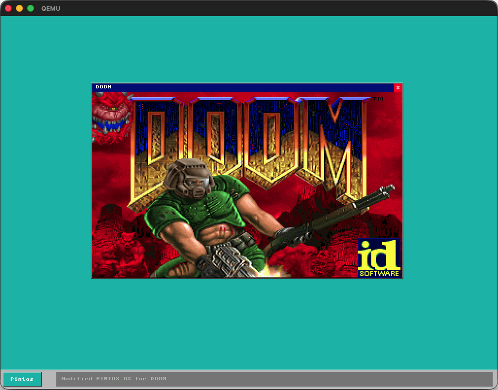

# Pintos DOOM: Kernel Panic Edition


This modified version of **Pintos** is specifically adapted to run **DOOM (1993)**. The project includes the adapted version of DOOM (located in `pintos/programs/doom`). This project and github-repo includes the .WAD-file from Shareware (Non-commercial game data).
To support DOOM, this version of Pintos is featuring a custom VESA window manager and an adapted version of DOOM (1993).
It features a custom graphical user interface and hardware keyboard state tracking.

**Please note:** This version utilizes **significantly more memory** than the standard educational version of Pintos.

* DOOM Engine: Originally created by id Software. The source code is open-source under the GNU GPL.
* Pintos: Originally created by Ben Pfaff for Stanford University's CS140 course.
* Game Data: This repository includes the shareware version of `doom.wad`.

Feel free to download this version of Pintos, explore the custom window manager, and make your own adaptations.

## Table of Contents
* [How to Run](#how-to-run)
* [Technical Information](#technical-information)
    * [Technical Implementations](#technical-implementations)
    * [Technical Requirements](#technical-requirements)
    * [Memory management](#memory-management)
    * [Troubleshooting](#troubleshooting)
    * [Syscall Implementation](#syscall-implementation)
    * [Project Structure](#project-structure)
    * [Known Limitations](#known-limitations)
* [Contributing](#contributing)
* [Credits and acknowledgments](#credits-and-acknowledgments)




## How to run
This OS is designed to be run using [QEMU](https://www.qemu.org/).

### Build the DOOM Binary

Navigate to the programs directory to compile and prepare the executable:

``` bash
cd ../programs
make clean
make doompintos
i686-elf-strip doompintos
```

### Build the Pintos Kernel

Navigate to the userprog directory to compile the operating system:

``` bash
cd ../userprog
make clean
make 
```

### Disk Setup & Data Loading

To ensure a clean state, reset the virtual disk and load the game data. Run these commands from the userprog directory:

Remove old disk and create a new one (60MB)
``` bash
rm -f filesys.dsk
../utils/pintos-mkdisk filesys.dsk --filesys-size=60
```

Format the file system
``` bash
../utils/pintos -f -q
```

Copy the DOOM binary and the WAD file to the Pintos disk
``` bash
../utils/pintos -p ../programs/doompintos -a doom -- -q
../utils/pintos -p ../programs/doom/doom1.wad -a doom1.wad -- -q
```

### Launch the Game

Start the Pintos kernel with 64MB of RAM and VGA support:
``` bash
../utils/pintos -m 64 -v -k --qemu -- run 'doom -iwad doom1.wad'
```     

## Technical information
### Technical implementations
This Pintos version includes:
* **Linear frame buffer:** Shifts from standard 80x25 text mode to a high resolution `1024x768` linear frame buffer (VBE). 
* **Custom VGA/VESA driver:** Manages hardware communication and maps the physical video memory directly to the kernel's virtual memory space
* **Double buffering system:** Buffer in the system memory that eliminates flicker when rendering windows and the mouse pointer.
* **Process to window mapping:** Each process has a unique connection to a `struct window` in the kernel space, that results in isolated rendering via syscalls.
* **Z-order window management:** A linked list manages the windows order, and when a window is pressed it goes to the front.
* **Mouse driver:** An adapted driver which handles the interrupts from the mouse. 

### Technical requirements
To run and build this project you need:
* A cross-compiler for x86 (e.g., i686-elf-gcc).
* QEMU with VGA support (standard in most distributions). [QEMU](https://www.qemu.org/)
* A system capable of emulating at least 64MB of RAM (standard Pintos usually is 4MB, which is insufficient for DOOM).

### Memory management
DOOM requires significantly more heap space than standard Pintos user programs. This kernel has been modified to:
* Increase the user pool memory limit.
* Support larger executable segments in the loader.
* Handle larger stack allocations for the game's static data arrays.
The standard Pintos loader is designed for small binaries. In this version the ELF loader to handle significantly larger Data and BSS segments than before. The page allocator has been changed to prevent the kernel from running out of frames during the initial WAD load (when DOOM is run).

### Troubleshooting
* Kernel Panic: If the kernel panics during loading, ensure you have allocated enough memory with the -m 64 flag.
* Filesystem capacity: The doom1.wad is approximately 4MB. Ensure the filesys.dsk is created with at least 10MB to accommodate the binary and data files.
* Input lag: If running on a slow host, try adding -accel kvm (Linux) or -accel hvf (macOS) to the QEMU command line in the Pintos utility scripts.

### Syscall implementation
To be able to run on Pintos, DOOM uses the following syscalls:
| Syscall | Number | Description |
| :--- | :---: | :--- |
| `open` | Standard | Opens the WAD file for reading |
| `filesize` | Standard | Retrieves the size of the opened file |
| `seek` | Standard | Moves the file pointer to a specific offset |
| `read` | Standard | Reads data from the WAD into the game heap |
| `close` | Standard | Closes the file handle |
| `write` | Standard | Used for console output and debugging |
| `sleep` | 13 | Suspends process execution (timing) |
| **`draw_frame`** | 21 | **Non-standard:** Swaps the VESA graphics buffer |
| **`time`** | 22 | **Non-standard:** Returns current system ticks |
| **`getc`** | 23 | **Non-standard:** Non-blocking keyboard input |

These need to be implemented, and are in this version. For more information check:
* doomgeneric_pintos.c in `pintos/programs/doom/doomgeneric_pintos.c`. This is the file that ports DOOM to pintos, and this is where syscalls are made.
* syscall.c in `pintos/userprog/syscall.c`. This file has the specific syscalls that are called. 

### Project Structure

Below is an overview of the key directories and files in this repository, highlighting the custom modifications for DOOM:

```text
.
├── devices/           # VESA graphics driver and keyboard state logic
│   └── gui.c          # High-level window management and GUI rendering logic.
│   └── vga.c          # Low-level driver for VGA/VESA hardware and framebuffer management.
├── lib/               # Standard Pintos libraries
├── programs/
│   └── doom/
│       └── doomgeneric_pintos.c  # The DOOM-to-Pintos bridge (HAL)
├── threads/           # Kernel initialization and memory management
├── userprog/
│   ├── process.c      # Modified loader to support large DOOM segments
│   └── syscall.c      # Custom syscalls (21, 22, 23) for DOOM
├── utils/             # Pintos disk utilities and QEMU scripts
├── LICENSE.DOOM       # GNU GPL v2 License for the DOOM engine
├── LICENSE.Pintos     # Stanford Academic License for the Pintos kernel
└── README.md          # Project documentation
```

### Known limitations
* Sound: Audio is currently not implemented (No PC Speaker or SoundBlaster drivers).
* Save Games: Filesystem persistence for save states is experimental.
* Network: Multiplayer (Deathmatch) is not supported.

# Contributing
I built this version of Pintos to push the boundaries of what it can do and also port a version of DOOM. 

**I welcome all improvements**. Feel free to fork this repo and submit a Pull Request. 

If you find a bug (especially one that causes a literal Kernel Panic), please open an Issue!

If you manage to make DOOM run on 4MB of RAM, you're a god. Please send a Pull Request immediately.

# Credits and acknowledgments
Developer: Ported and modified for Pintos by Kevin Gullander (2026).

* **DOOM Engine:** Originally developed by [id Software](https://www.idsoftware.com/en). This project uses the open-source GPL version of the engine.

* **Pintos OS:** Developed by Ben Pfaff and others at [Stanford University](https://pintos-os.org/) for educational purposes.

* **doomgeneric:** This port utilizes the [doomgeneric](https://github.com/ozkl/doomgeneric) abstraction layer created by ozkl to bridge the engine with Pintos syscalls.

Please see the license in the project for specific information. 